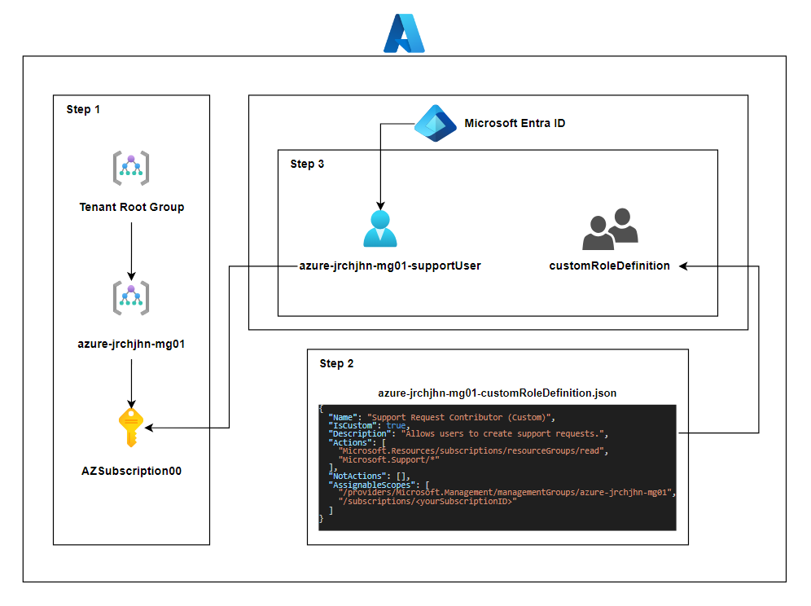
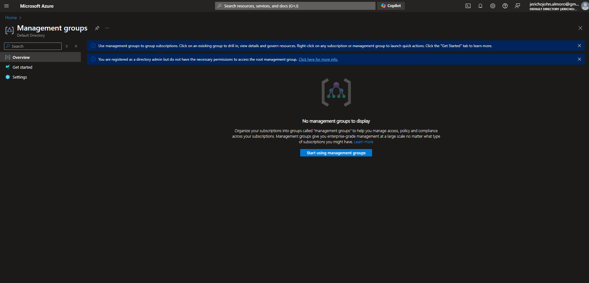

<h1 align="center" style="display: block; font-size: 2.5em; font-weight: bold; margin-block-start: 1em; margin-block-end: 1em;">
Configuration of Custom Role Permission in Azure
</h1>

<div align="center">
    
    
    
    
</div>

## Description

This repository provides guidance on configuring user account permissions within an organization’s Azure environment. The configuration ensures that as the organization scales, managing multiple subscriptions remains streamlined. Users are granted the capability to create support requests and view resource groups while restricting their access to the individual resources within those groups. This setup balances operational efficiency with necessary access controls.

## Architecture Diagram



## Requirements

- Existing Azure Account
- Existing Tenant

## Objectives

- Step 1: Implementing Management Groups
- Step 2: Create custom Role-Based Access Control Roles
- Step 3: Assign the custom Role-Based Access Control Roles and Verify new account

### Step 1: Implementing Management Groups

- Navigate to **Management groups** and as you can see, you do not have the necessary permissions for access management. To enable this, navigate to **Microsoft Entra ID** using the portal search bar

  

- Within the Azure Directory (**Microsoft Entra ID**), navigate to **Properties** and go to **Access management for Azure Resources**, toggle the button and click on **save**

  

- Go back to **Management groups** and click on **Start using management groups**

  

- Click on **Create** and input the management group ID and management group display name. Then, go ahead and click the **Submit** button.

  

- After creating the management group, click the newly created mg **`azure-jrchjhn-mg01`** and navigate to subscription, then **add** and click on **save** button.

  

- After creating the subscription, open the subscription **`AZSubscription00`** and copy the **Subscription ID** for Step 2
  

### Step 2: Create custom Role-Based Access Control Roles

- Create a file **`azure-jrchjhn-mg01-customRoleDefinition.json`** and save this .json content. As you can see below, we are going to create a support request contributor role that will allow the user of this role to read resource groups as well as support actions.

  ```json
  {
    "Name": "Support Request Contributor (Custom)",
    "IsCustom": true,
    "Description": "Allows to create support requests",
    "Actions": [
      "Microsoft.Resources/subscriptions/resourceGroups/read",
      "Microsoft.Support/*"
    ],
    "NotActions": [],
    "AssignableScopes": [
      "/providers/Microsoft.Management/managementGroups/azure-jrchjhn-mg01",
      "/subscriptions/e87a90b2-ecb3-4e49-a47e-010690560f5d"
    ]
  }
  ```

  ```json
  {
    "Name": "Support Request Contributor (Custom)",
    "IsCustom": true,
    "Description": "Allows users to create support requests.",
    "Actions": [
      "Microsoft.Resources/subscriptions/resourceGroups/read",
      "Microsoft.Support/*"
    ],
    "NotActions": [],
    "AssignableScopes": [
      "/providers/Microsoft.Management/managementGroups/azure-jrchjhn-mg01",
      "/subscriptions/e87a90b2-ecb3-4e49-a47e-010690560f5d"
    ]
  }
  ```

- Go to the navigation bar and click on the cloud shell icon _(if you don’t have any storage account yet, go ahead and create one as shown below)._

  

- After accessing the cloud Powershell, navigate the saved .json file we have created earlier on our local machine and upload it to the cloud shell

  

- To confirm that you have uploaded the file, type **`dir`** to list the files and type:
  **`New-AzRoleDefinition -InputFile $HOME/azure-jrchjhn-mg01-customRoleDefinition.json`** in order to create a custom role.
  

### Step 3: Assign the custom Role-Based Access Control Roles and Verify new account

- Go to **Microsoft Entra ID** (Formerly Active Directory Services) and go to Manage>Users. Click on **New User** button and **Create a new user**

  

- Create the new user with the following details, make sure to click on create.

  

- Refresh the page and select the new user: **Juan Dela Cruz**

  

- Copy the **User principal name** ([juandelacruz@jerichojohnalmorogmail.onmicrosoft.com](mailto:juandelacruz@jerichojohnalmorogmail.onmicrosoft.com))

  

- Navigate back to **management groups** and click on the management group we have created earlier **`azure-jrchjhn-mg01`**. Then, click on **Access control** from the left pane and click on **Add > Add role assignment**.

  

- Change the filter to custom and as you can see, the custom role we have created earlier loaded in the Add Role Assignment. Click on the custom role and click next

  

- Click on **Select members** and make sure to select our newly created user **`Juan Dela Cruz`**

  

- Make sure to review the role and its details before clicking the **Review + assign** to assign the custom role to its user

  

- Open a new browser and go to [portal.azure.com](http://portal.azure.com) and sign in the newly created account. This will login the new account and ask for a new password
  
- Once signed in, now the account can do the allowed actions from the .json file we have created earlier (**New Support Request and Viewing of Resource Groups)**
  
  
  
